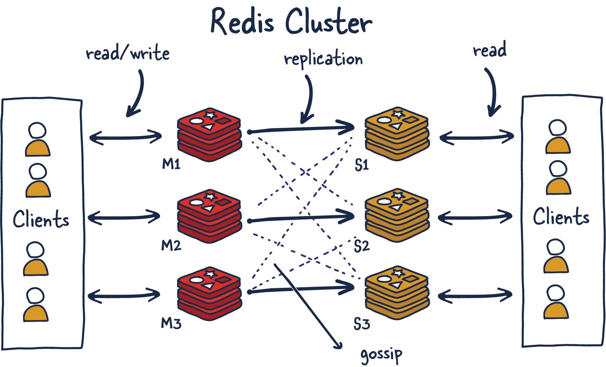

I am a double major in mathematics and computer science at **Northeastern University's Khoury College**. I specialize in distributed systems and machine learning engineering. My work spans production-grade backend systems, ML pipelines, and full-stack development. I love to build scalable and reliable software. 

I recently interned at **Sepal AI (YC S24)**. The company was later acquired by Mercor in February 2026. I have also interned at Dartmouth-Hitchcock Medical Center where I built a novel convolutional neural network to classify anomalies across fourteen pathologies for chest X-ray detection. 

I have been a competitive programmer for over four years and competed in the **USA Computing Olympiad**. I was ranked in the platinum division, which is composed of the top two-hundred high school competitive programmers. 

I will be interning @ **AllSpice.io** as a remote software engineer intern in Summer 2026 doing GenAI work and improving agentic hardware design reviews alongside a cracked team!

> Much of my work from internships and industry projects remains private to respect company IP. I'm happy to provide access to specific repositories or discuss implementations in detail. Please feel free to reach out!

**Website:** [jpandya.com](https://jpandya.com)  
**Email:** jaimanpandya@email.com  
**LinkedIn:** [linkedin.com/in/jaimanpandya](https://www.linkedin.com/in/jaimanpandya)

---
 
## Technical Focus
 
I specialize in building distributed systems where scalability and reliability are non-negotiable. My work centers on designing backend architectures that handle high-throughput workloads through event-driven patterns and async message queuing. I've architected production systems using microservice orchestration with Docker and Kubernetes on AWS through implementing fault-tolerant pipelines that maintain state consistency across distributed worker nodes. Performance optimization is a core focus. I find system design decisions intriguing. I love figuring out where to draw service boundaries, how data flows through the architecture, and what deployment strategy actually works under production. 
 
On the machine learning side, I build end-to-end pipelines from model training through production deployment. I have particular depth in PyTorch-based architectures for computer vision tasks, but I approach ML engineering with the same infrastructure rigor as backend systems. This means versioned datasets, reproducible training runs, and monitoring for model drift in production. My comfortability with React and TypeScript allows me to own features vertically when needed, but my core strength is backend infrastructure and the architectural decisions that determine whether systems scale gracefully or collapse under load.

  

---

## Comprehensive Tech Stack
 

**Languages:** Python, TypeScript, SQL, C++, Go  
**Machine Learning:** Pydantic AI, LangChain, RAG, TensorFlow, PyTorch  
**Systems:** FastAPI, Node.js, Redis, Kafka, Docker, Kubernetes  
**Cloud:** AWS, PostgreSQL, GitHub Actions
 
---

## Recognition and Awards
- YC Summer Conference '25
- YC AI Startup School '25
- YC Founders & Builders
- YC and MongoDB Hackathon
- Remark AI Talent and Startup Showcase
- YHack 2026 — Yale University
- LA Hacks 2026 — UCLA
- Yale and HRT Undergraduate Trading Competition 
- USA Computing Olympiad (USACO) Platinum Division 
- IMC Prosperity Quantitative Trading Challenge 
- MIT Informatics Tournament
- MIT Winter Informatics Tournament 
- Jane Street Summer Social
- Research Symposium: Frontier in Soft Matter and Macromolecular Networks
- Published Research @ Dartmouth-Hitchcock Medical Center

## Contact

I am always open to discussing technical challenges, potential collaboration opportunities, or sharing insights from my work. For access to private repositories or detailed technical walkthroughs, please email me!

**Email:** jaimanpandya@email.com  
**LinkedIn:** [linkedin.com/in/jaimanpandya](https://www.linkedin.com/in/jaimanpandya)  
